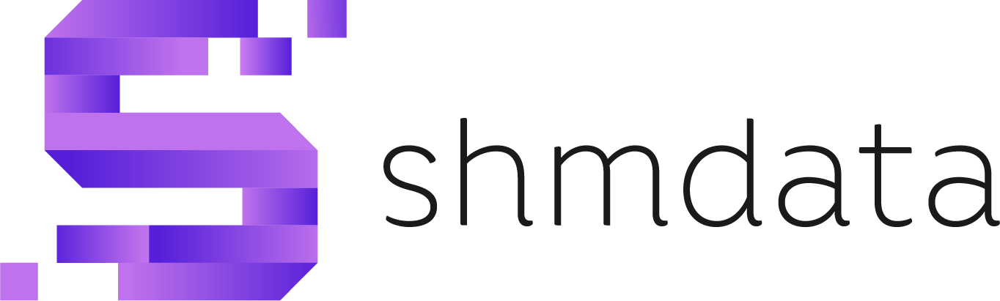
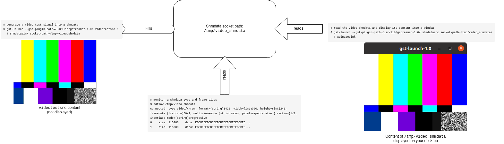

Shmdata
=======



[](https://www.gnu.org/licenses/lgpl-3.0) [](https://gitlab.com/sat-metalab/shmdata/commits/develop) [](https://gitlab.com/sat-metalab/shmdata/commits/develop)

[[_TOC_]]

## What is shmdata ?
A library to share streams of framed data between processes via shared memory. It supports any kind of data stream:  it has been used with multichannel audio, video frames, 3D models, OSC messages, and various others types of data. Shmdata is server-less, but requires applications to link data streams using socket path (e.g. "/tmp/my-shmdata-stream"). Shmdata is very fast and allows processes to access data streams without the need for extra copies.

The communication paradigm is 1 to many, i.e., one writer is making available data frames to several followers. Followers and writers can hot connect & disconnect. Shmdata transmission supports buffer resizing. Each shmdata has a type specified with a string description, itself published by the shmdata writer at each reconnection. The type is specified as a user-defined string. Although left to the user, we encourage type specification to follow GStreamer 1.0 caps specification format, for instance "audio/x-raw,format=S16LE,channels=2,layout=interleaved". 

Note the existence of [NDI2shmdata](https://gitlab.com/sat-metalab/ndi2shmdata) that converts shmdata to [NewTek's NDI](http://ndi.newtek.com), and _vice versa_.

## Technical consideration

Shmdata runs on Linux and should works on Unix-like operating systems that supports System V shared memory, System V semaphore and Unix sockets, such as OSX.

Shmdata is intended to be used as an extension to applications in order to enable shmdata reading and/or writing, thanks to one of the shdmata APIs. Currently, the following languages are available for implementation specific tools or to add shmdata support in your software: C/C++, Python and GStreamer.


## Getting started

### Installation

On ubuntu 20.04, shmdata can be installed as follows:
```
sudo add-apt-repository ppa:sat-metalab/metalab
sudo apt-get update
sudo apt install libshmdata
```

Otherwise, you can [install shmdata from sources](doc/install-from-sources.md)

### First shmdata transmission

The following command sequence will let you check your shmdata installation. It describes how to i) generate a video test signal into a shmdata, ii) monitor it, and iii) read the video shmdata for display. All these steps are performed by separate commands running on the same computer.

#### Transmit video through shmdata with GStreamer

Create a shmdata in which raw video will be sent. The path to the shmdata will be `/tmp/video_shmdata`.
```
# generate a video test signal into a shmdata
gst-launch --gst-plugin-path=/usr/lib/gstreamer-1.0/ videotestsrc ! shmdatasink socket-path=/tmp/video_shmdata
```
Note: The command `gst-launch` allows for running [GStreamer pipeline](https://gstreamer.freedesktop.org/documentation/tools/gst-launch.html) from command line. Here the pipeline is composed of two elements: `videotestsrc` that transmits its video stream to the `shmdatasink` element. The parameter `socket-path` indicates to the `shmdatasink` where the shmdata must be located. Finally, the `--gst-plugin-path` option tells `gst-launch` where it can find the `shmdata` GStreamer elements (by default, shmdata GStreamer plugins are installed in `/usr/lib/gstreamer-1.0/`).

#### Monitor a shmdata
The `sdflow` utility is installed along with the shmdata library. It prints the shmdata metadata once connected with the shmdata writer, and then a line of information for each buffer pushed by the shmdata writer. Keep the video shmdata running, and then from a new terminal type:
```
# monitor a shmdata type and frame sizes 
$ sdflow /tmp/video_shmdata 
connected: type video/x-raw, format=(string)I420, width=(int)320, height=(int)240, framerate=(fraction)30/1, multiview-mode=(string)mono, pixel-aspect-ratio=(fraction)1/1, interlace-mode=(string)progressive
0    size: 115200    data: EBEBEBEBEBEBEBEBEBEBEBEBEBEBEB...
1    size: 115200    data: EBEBEBEBEBEBEBEBEBEBEBEBEBEBEB...
etc
```

Note that you can [monitor a shmadata framerate using pv and sdflow](doc/monitor-framerate).

#### Display video from the video shmdata

With the video transmission still running (and optionally, the `sdflow` monitoring), open a new terminal window and display the video using the following command:
```
# read the video shmdata and display its content into a window
gst-launch --gst-plugin-path=/usr/lib/gstreamer-1.0/ shmdatasrc socket-path=/tmp/video_shmdata ! xvimagesink
```


### Use shmdata in your code

In previous section, GStreamer is used in order to illustrate a transmission, but you can also include shmdata in you project with specific languages, using native shmdata API. Here follows some examples in various languages:

* [C++](tests/check-writer-follower.cpp)
* [C](test/check-c-wrapper.cpp)
* [Python3](wrappers/python/example.py)
* [GStreamer writer](gst/check-shmdatasink.c)
* [GStreamer follower](gst/check-shmdatasrc.c)

Note that in order to develop with shmdata C or C++ API, you may want to install development files:
```
sudo apt install libshmdata-dev
```
Then C and C++ using shmdata can be compiled with help from pkgconfig, as follows:
```bash
# C code:
gcc -o check-c-wrapper $(pkg-config --cflags shmdata-1.3) ./check-c-wrapper.cpp $(pkg-config --libs shmdata-1.3)

# C++ code
g++ -o check-writer-follower $(pkg-config --cflags shmdata-1.3) ./check-writer-follower.cpp $(pkg-config --libs shmdata-1.3)
```
 

## Contribution

To contribute to shmdata, see the [contribution guide](CONTRIBUTING.md)

## Sponsors

This project is made possible thanks to the Society for Arts and Technology. [SAT](http://www.sat.qc.ca/) and to the Ministère de l'Économie et de l'Innovation du Québec (MEI).


## About us

Shmdata is maintained by the [Metalab](https://sat.qc.ca/fr/recherche/metalab), the Society for Arts and Technology [SAT] research laboratory. Our mission is to provide artists and creators with a powerful ecosystem of immersion and telepresence software for live arts and new media installations. 

Shmdata is also used in the [Scènes ouvertes](http://sat.qc.ca/en/scenes-ouvertes) project: a network of more than 20 venues from all across the province of Quebec collaborating through artistic telepresence installations . 

See a list of shmdata authors [here](AUTHORS.md).
