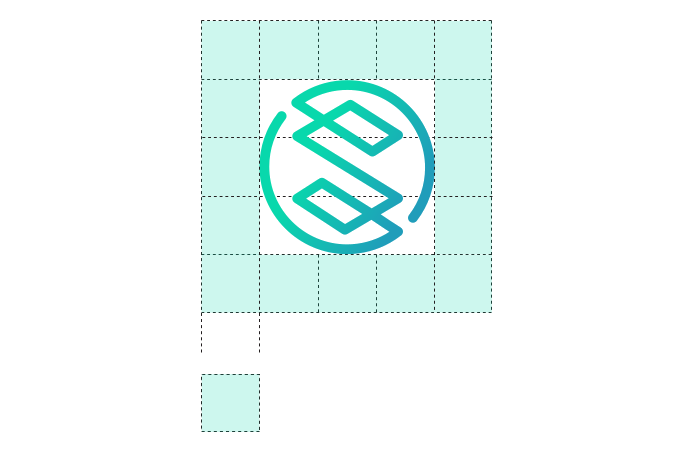
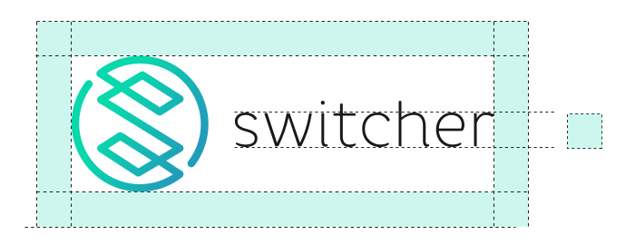
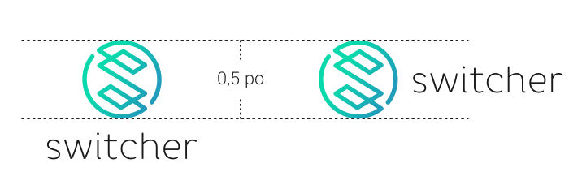
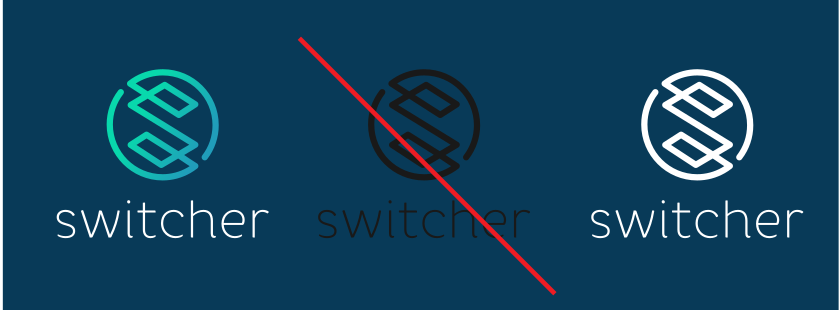
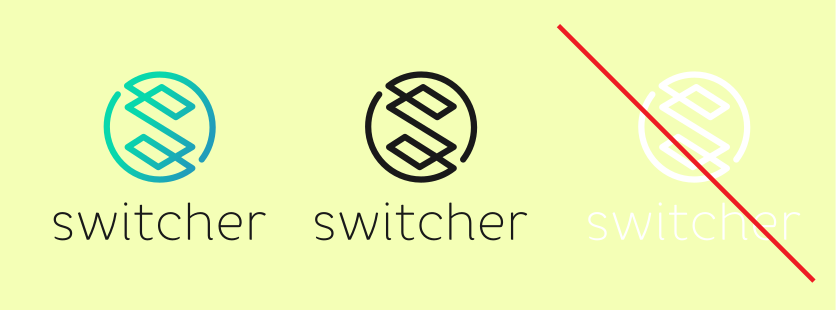
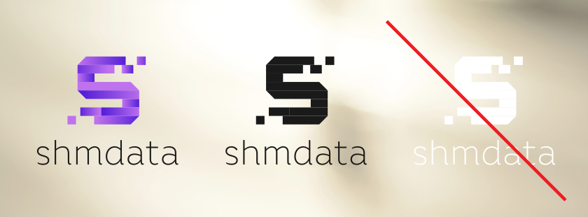

# GRAPHIC CHARTER 


## PRIMARY AND SECONDARY LOGOS

#### GRAPHIC GRID

Here is the graphic grid of the logo, with the proportions to be respected at each use of the logo. Whether it is to appear in an application, on a website, on a letterhead, on a poster or in a series of logos, the proportions must ALWAYS be respected.



#### PROTECTIVE SPACE

At all times, the logo must be surrounded by a clear area to be legible and communicate effectively. No text, lines, typographical elements, images, photographs or illustrations must occupy this space.




#### MINIMUM SIZE

The logo should never be used when the main icon is less than 0.5 inches high.



## COLOR CODES

#### COLORS (GRADIENT)


```
C88 M0 Y34 K0
R8 G216 B172
#08d8ac

C87 M8 Y10 K0
R32 G157 B186
#209dba
```
#### BLACK


```
C0 M0 Y0 K90
R26 G26 B26
#1a1a
```
#### WHITE


```
C0 M0 Y0 K0
R255 G255 B255
#ffffffff
```
## GENERAL USES

### Plain and dark background

To maximize the legibility of the logo on a dark, plain background, it is recommended to use the color or white version of the logo.

NEVER use the black version.




### Plain and clear background

To maximize the legibility of the logo on a plain and clear background, only the color or black version of the logo is allowed.

NEVER use the white version.



### Very clear photo

To maximize the legibility of the logo on a very clear photo, it is recommended to use the black version of the logo. 

NEVER use the white version.



## Maximum readability

To ensure maximum legibility of the logo, you must never modify or alter any part of the logo.
