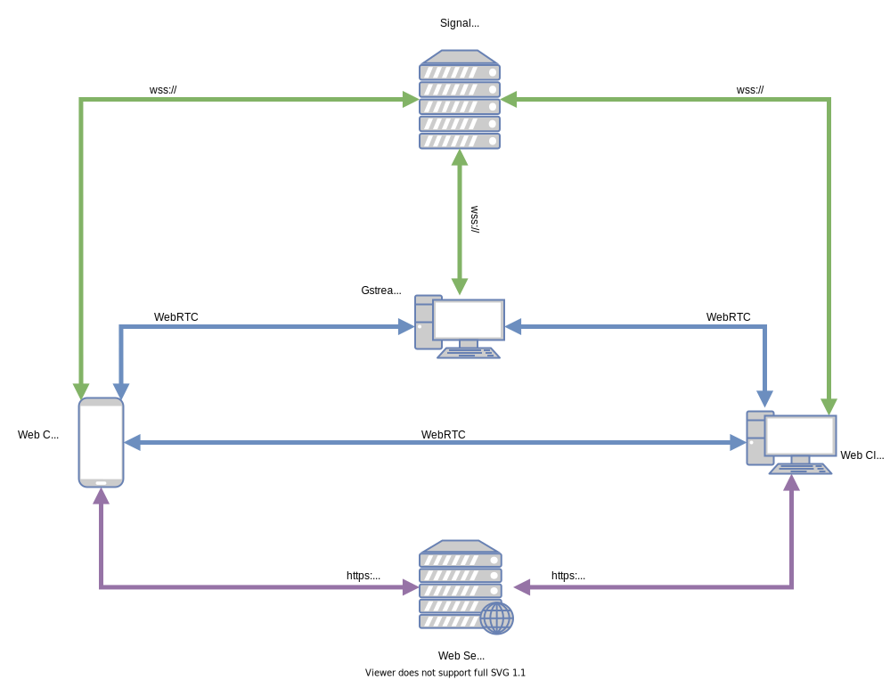

The webrtc quiddity allows for joining webrtc sessions. This is an experimental quiddity, and we know the following work is still required:

* Enable reception from multiple web clients. It currently works with only one remote client.
* Enable the webrtc quiddity to read shmdata containing already compressed video.  
* Fix the template web page: it sometimes fail to display some participants, but not all.

In order to test the quiddity, you need to get the following architecture to work:

Here are the steps:
1. Run the signaling server, as described in [here](signaling/README.md).
2. Run the web server that distributes the web client, as described [here](web/README.md)
3. Open a browser, accept manually the certificate at [https://localhost:8443/](https://localhost:8443/). Then close the page.
4. Open a browser, accept manually the certificate at [https://localhost:8000/](https://localhost:8000/), then accept to share your audio and video with the web page.
5. Fill the form with your user name and click connect.
6. Run the python script that let a switcher instance connect to the room: `./connect_room.py`.
7. Check the script joined the room from the web page.
8. Check the audio shmdata is created and active: `sdflow /tmp/switcher_webrtc_1_*audio`.
9. Check the video shmdata is created and active: `gst-launch shmdatasrc socket-path=/tmp/switcher_webrtc_1_*video ! xvimagesink`.
10. Optionally do the video-pattern dance.
