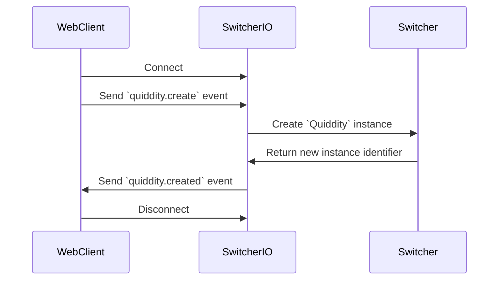

Websockets
======

The `SwitcherIO` package essentially act as a bidirectionnal bridge between [Switcher](https://gitlab.com/nicobou/switcher) and the front-end, and makes use of [PyQuid](../../doc/python-scripting.md).

In fact, the goal is to roughly have a 1:1 equivalency between a Websocket route and a [PyQuid](../../doc/python-scripting.md) call.

It uses [python-socketio](https://python-socketio.readthedocs.io/en/latest/) with an [aiohttp](https://docs.aiohttp.org/en/stable/) backend to provide an async web server capable of forwarding requests to Switcher (with the help of the [PyQuid](../../doc/python-scripting.md) module).



# Prerequisites

| Software  | Version | Instructions
|-----------|---------|-------------
| Switcher  | Latest  | See [install instructions](../../doc/INSTALL.md)

# Getting Started

Create a new python virtual environment using the built-in [venv](https://docs.python.org/3.8/library/venv.html) module:

```bash
python3 -m venv env
```

We are now able to **activate** the virtual environment by sourcing the `activate script` from the [SwitcherIO]() module:

```bash
. activate
```

Finally, we can install required dependencies:

```bash
pip install -r requirements.txt
```

# Running the server

Whenever your virtual environment is **active**, starting the **server** is as easy as:

```bash
python3 wrappers/switcherio/server.py
python3 wrappers/switcherio/server.py --debug # will enable the debug logs
```

Note that once done, we can **deactivate** the virtual environment by issuing the following function sourced by the environment:

```bash
deactivate
```

# Debugging `switcherio`

In order to debug the `switcher` instance from `switcherio`, you can use gdb:

```bash
gdb --args python3 wrappers/switcherio/server.py
pdb -m python3 wrappers/switcherio/server.py

# if you feel adventurous...
gdb --args python3 -m pdb wrappers/switcherio/server.py
```

# Testing `switcherio`

From the package directory `wrappers/switcherio`, you can run any test cases by issuing:

```bash
python3 -m unittest tests/test_name
```

To run the full test suite, use:

```bash
python3 -m unittest
```
